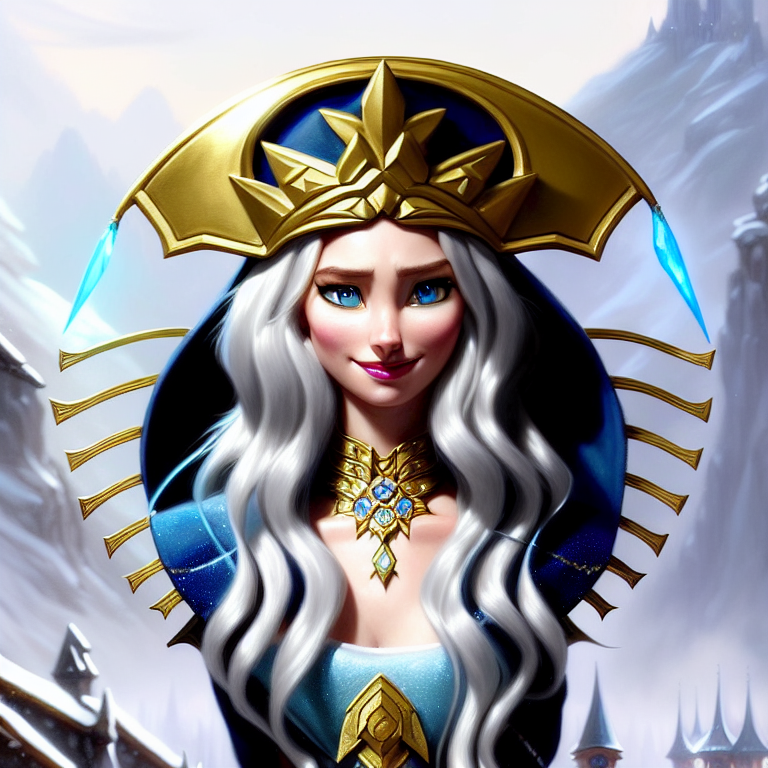
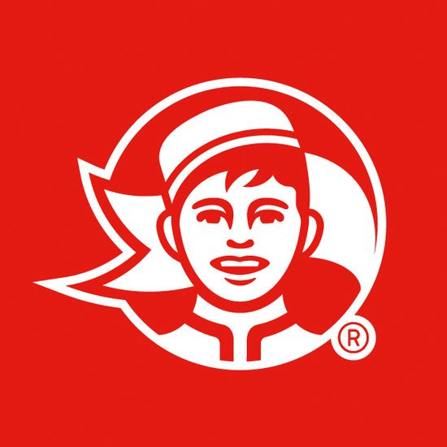
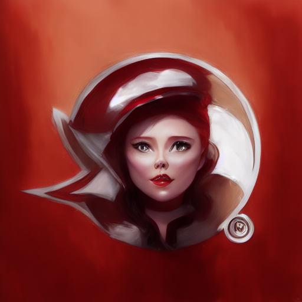
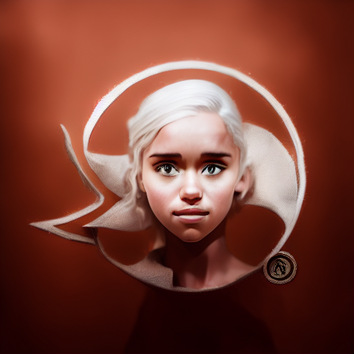
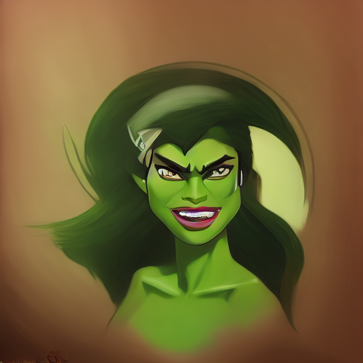

# VISII - Visual Instruction Inversion 👀

### [arXiv](https://arxiv.org/abs/2307.14331) | [BibTeX](#BibTeX) | [Project Page](https://thaoshibe.github.io/visii/)

|  |
|:--:|
| *Visii* learn instruction from before → after image, then apply to new images to perform same edit.|

[👀 **Visual Instruction Inversion: Image Editing via Image Prompting**](https://thaoshibe.github.io/visii/) (NeurIPS 2023)<br>
[Thao Nguyen](https://thaoshibe.github.io/), [Yuheng Li](https://yuheng-li.github.io/), [Utkarsh Ojha](https://utkarshojha.github.io/), [Yong Jae Lee](https://pages.cs.wisc.edu/~yongjaelee/) <br>
🦡 University of Wisconsin-Madison


>TL;DR: A framework for *inverting visual prompts* into *editing instructions* for text-to-image diffusion models.


>ELI5 👧: You show the machine how to perform a task (by images), and then it replicates your actions. For example, it can learn your drawing style 🖍️ and use it to create a new drawing 🎨.

<div style="align: center; text-align:center;">
	<center>
  
  <center>
</div>

🔗 Jump to: [Requirements](#requirements) | [Quickstart](#quickstart) | [Visii + Ip2p](#visual-instruction-inversion) | [Visii + ControlNet](#visii-controlnet) | [BibTeX](#bibtex) | [🧚 Go Crazy 🧚](#starbucks-logo)

#### Requirements

This script is tested on `NVIDIA RTX 3090`, Python 3.7 and PyTorch 1.13.0 and [diffusers](https://github.com/huggingface/diffusers). 


```sh
pip install -r requirements.txt
```

#### Quickstart

Visual Instruction Inversion with [InstructPix2Pix](https://www.timothybrooks.com/instruct-pix2pix/).
```sh
# optimize <ins> (default checkpoint)
python train.py --image_folder ./images --subfolder painting1
# test <ins>
python test.py
# hybrid instruction: <ins> + "a squirrel" (default checkpoint)
python test.py --hybrid_ins True --prompt "a husky" --guidance_scale 10
```

Result image will be saved in `./result` folder.

<table>
  <tr>
  	<td colspan=1><b>Before:</b><br></td>
  	<!-- <td>⇨<font style="color:red"> &#60;instruction&#62;🔥 </font>⇨</instruction> -->
  	<td><b>After:</b><br></td>
  	<td colspan=1><b>Test:</b><br></td>
  </tr>
</table>

Visii learns editing instruction from **dog → watercolor dog** image, then applies it into new image to perform same edit.
You can also concatenate new information to achieve new effects: **dog → watercolor husky**.

<table>
  <tr>
    <td></td>
    <td><i>Different photos are generated from different noises.</i></td>
  </tr>
  <tr>
  	<td style='text-align:right;'><font style="color:blue"> &#60;ins&#62; </font></td>
    <td colspan=1></td>
  </tr>
  <tr>
  	<td>&#60;ins&#62; + <b>"a husky" 🐶</b></td>
    <td></td>
  </tr>
    <tr>
  	<td>&#60;ins&#62; + <b>"sa quirrel" 🐿️</b></td>
    <td></td>
  </tr>
   <tr>
  	<td>&#60;ins&#62; + <b>"a tiger" 🐯</b></td>
    <td></td>
  </tr>
   <tr>
  	<td>&#60;ins&#62; + <b>"a rabbit" 🐰</b></td>
    <td></td>
  </tr>
   <tr>
  	<td>&#60;ins&#62; + <b>"a blue jay" 🐦</b></td>
    <td></td>
  </tr>
   <tr>
  	<td>&#60;ins&#62; + <b>"a polar bear" 🐻‍❄️</b></td>
    <td></td>
  </tr>
   <tr>
  	<td>&#60;ins&#62; + <b>"a badger" 🦡</b></td>
    <td></td>
  </tr>
   <tr>
  	<td colspan=2 style='text-align:right;'> <i>on & on ...</i></td>
  </tr>

</table>

> ⚠️ <i>If you're not getting the quality that you want... You might tune the <b>guidance_scale</b></i>.
<table>
  <tr>
    <td></td>
  </tr>
  <tr><td><b>&#60;ins&#62; + "a poodle"</b>: From left to right: Increase the guidance scale (4, 6, 8, 10, 12, 14)</td></tr>
</table>

###### Starbucks Logo
🧚🧚🧚 Inspired by [this reddit](https://www.reddit.com/r/StableDiffusion/comments/11avhpn/starbucks_logo_exploration_with_controlnet/), we tested Visii + InstructPix2Pix with Starbucks and Gandour logos.
<table>
  <tr>
    <td><b>Before:</b><br></td>
    <!-- <td>⇨<font style="color:red"> &#60;instruction&#62;🔥 </font>⇨</instruction> -->
    <td><b>After:</b><br></td>
    <td colspan=2></td>
  </tr>
  <tr>
    <td><br><b>Test:</b><br></td>
    <td><b><font style="color:blue"> &#60;ins&#62; <br></font></b>+ "Wonder Woman"<br></td>
    <td><b><font style="color:blue"> &#60;ins&#62; <br></font></b>+ "Scarlet Witch"<br></td>
    <td><b><font style="color:blue"> &#60;ins&#62; <br></font></b>+ "Daenerys Targaryen"<br></td>
  </tr>

  <tr>
    <td></td>
    <td><b><font style="color:blue"> &#60;ins&#62; <br></font></b>+ "Neytiri in Avatar"</font><br></td>
    <td><b><font style="color:blue"> &#60;ins&#62; <br></font></b>+ "She-Hulk"<br></td>
    <td><b><font style="color:blue"> &#60;ins&#62; <br></font></b>+ "Maleficent"<br></td>
  </tr>
</table>

*(If you're still not getting the quality that you want... You might tune the InstructPix2Pix parameters. See [Tips](https://github.com/timothybrooks/instruct-pix2pix#tips) or [Optimizing progress ⚠️](#optimizing-progress) for more details.)*

#### Visual Instruction Inversion

**1. Prepare before-after images:** A basic structure for image-folder should look like below.
`{image_name}_{0}.png` denotes before image, `{image_name}_{1}.png` denotes after image.

By default, we use `0_0.png` as the before image and `0_1.png` as the after image. `1_0.png` is the test image.

```
{image_folder}
└───{subfolder}
    │   0_0.png # before image
    │   0_1.png # after image
    │   1_0.png # test image
```
Check `./images/painting1` for example folder structure.

**2. Instruction Optimization:** Check the `./configs/ip2p_config.yaml` for more details of hyper-parameters and settings.

###### Visii + InstructPix2Pix
```sh
# optimize <ins> (default checkpoint)
python train.py --image_folder ./images --subfolder painting1
# test <ins>
python test.py --log_folder ip2p_painting1_0_0.png
# hybrid instruction: <ins> + "a squirrel" (default checkpoint)
python test_concat.py --prompt "a husky"
```


###### Visii + ControlNet!
We plugged Visii with [ControlNet 1.1 InstructPix2Pix](https://github.com/lllyasviel/ControlNet-v1-1-nightly#controlnet-11-instruct-pix2pix).

```sh
# optimize <ins> (default checkpoint)
python train_controlnet.py --image_folder ./images --subfolder painting1
# test <ins>
python test_controlnet.py --log_folder controlnet_painting1_0_0.png
```

#### Optimizing Progress

By default, we use the lowest MSE checkpoint (`./logs/{foldername}/best.pth`) as the final instruction.

Sometimes, the `best.pth` checkpoint might not yield the best result.

If you want to use a different checkpoint, you can specify it using the `--checkpoint_number` argument.

A visualization of the optimization progress is saved in `./logs/{foldername}/eval_100.png` ⚠️. You can visually select the best checkpoint for testing.

```sh
# test <ins> (with specified checkpoint)
python test.py --log_folder ip2p_painting1_0_0.png --checkpoint_number 800
# hybrid instruction: <ins> + "a squirrel" (with specified checkpoint)
python test_concat.py --prompt "a husky" --checkpoint_number 800
```

<table>
  <tr>
    <td></td>
  </tr>
  <tr>
    <td><i>From left to right: [Before, After, <b>Iter 0, Iter 100, ..., Iter 900</b>]. You can visually select the best checkpoint for testing.</i></td>
  </tr>
</table>

- *Side note: Before-after image should be algined for better results.*

#### Acknowledgement
Ours code is based on [InstructPix2Pix](https://huggingface.co/docs/diffusers/main/en/api/pipelines/stable_diffusion/pix2pix), [Hard Prompts Made Easy](https://github.com/YuxinWenRick/hard-prompts-made-easy), [Imagic](https://github.com/huggingface/diffusers/tree/main/examples/community#imagic-stable-diffusion), and [Textual Inversion](https://github.com/rinongal/textual_inversion). You might also check awesome [Visual Prompting via Image Inpainting](https://yossigandelsman.github.io/visual_prompt/).
Thank you! 🙇‍♀️

Photo credit: [Bo the Shiba & Mam the Cat 🐕🐈](https://www.instagram.com/avoshibe/).

<!-- #### To-do
- [x] Visii + Ip2p
- [x] Visii + ControlNet
- [x] Validate: Visii + Ip2p
- [] Validate: Visii + ControlNet
-  -->
#### BibTeX

```
@inproceedings{
nguyen2023visual,
title={Visual Instruction Inversion: Image Editing via Image Prompting},
author={Thao Nguyen and Yuheng Li and Utkarsh Ojha and Yong Jae Lee},
booktitle={Thirty-seventh Conference on Neural Information Processing Systems},
year={2023},
url={https://openreview.net/forum?id=l9BsCh8ikK}
}
```
